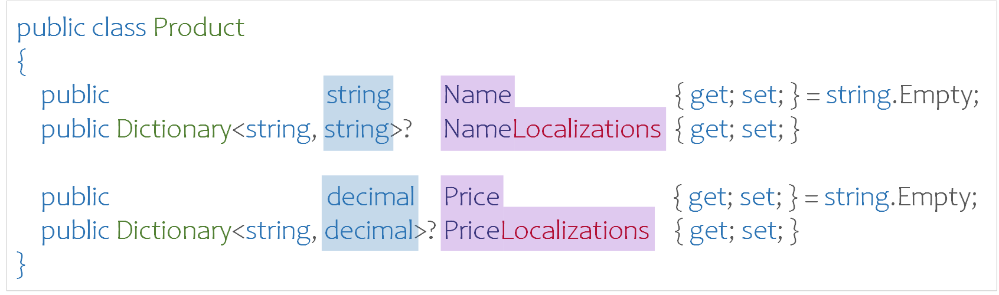

# Data-driven localization for .NET REST APIs
Because of the high level of automation in the cloud, software models and data are becoming increasingly dynamic. Let's take the example of an online fruit shop that sells its products in several countries. New products are entered by users in different languages.

When designing REST APIs with localized model data, the following considerations must be taken into account 
- What languages need to be supported?
- What data needs to be localized (text, numbers, images, etc.)?
- Which endpoints will be required to manage the localized objects?
- Which endpoints will deliver the localized data?
- How will the localized data be managed in relational database systems?

Scalable REST APIs separate information into translatable and readable data. Model data management endpoints contain all localization data. Within the online store endpoints, the data is delivered in a specific language. This saves resources and often provides ensures that not all information is distributed in all languages.

> In addition to data localization, the following considerations are also important for REST APIs that rely on cultural settings to convert numeric, currency, and date data.

REST API product localization:
<p align="center">
    
</p>

1. The REST client identifies available cultures.
2. Products are captured and submitted in multiple languages.
3. The REST client requests the products in a specific language as a query string, HTTP request header, or cookie.
4. The REST API returns the localized product data.

To use the localization features described here, the NuGet package [RestApiLocalization.NET]() must be installed. The package includes the management of supported system cultures (`Culture Provider`) as well as the extension methods for localizing data.

## Culture - the foundation of localization
NET cultures have a unique name according to the rules of [RFC4646/ISO639/ISO3166](https://learn.microsoft.com/en-us/dotnet/api/system.globalization.cultureinfo#culture-names-and-identifiers), which defines three levels for determining the culture:
<p align="center">
    
</p>

The languages registered in the Windows system can be selected according to the following criteria:
- `Neutral` culture such as `en` or `de`.
- `Specific` culture such as `en-US` or `de-DE`.
- `Installed` culture, which is installed on the REST API computer.
- `Custom` custom user cultures.
- `Replacement` culture for replaced default cultures.

> Read mote about the .NET [Culture Types](https://learn.microsoft.com/en-us/dotnet/api/system.globalization.culturetypes).

### Culture Provider
The system culture functions are specified in the `ICultureProvider` interface and provide the ability to limit the available cultures and control the working culture when processing API requests.
```csharp
public interface ICultureProvider
{
    /// <summary>Get the default culture name</summary>
    string DefaultCultureName { get; }

    /// <summary>Get the current culture</summary>
    CultureInfo CurrentCulture { get; }

   /// <summary>Get the current UI culture</summary>
    CultureInfo CurrentUICulture { get; }

    /// <summary>Set the current application und UI culture</summary>
    void SetCurrentCulture(string cultureName);

    /// <summary>Get the culture by name</summary>
    CultureInfo? GetCulture(string cultureName);

    /// <summary>Get the supported cultures</summary>
    IList<CultureInfo> GetSupportedCultures();

    /// <summary>Get the supported culture descriptions</summary>
    IList<CultureDescription> GetSupportedCultureDescriptions();
}
```

In the REST application, the `ICultureProvider` service is set up at startup.
```csharp
private static void SetupLocalization(IServiceCollection services)
{
    // culture
    var scope = new CultureScope(
        neutral: true,
        specific: true,
        installed: true,
        custom: false,
        replacement: false);
    string[] supportedCultures = {
        "en", "en-US", "en-GB",
        "de", "de-DE", "de-AT", "de-CH",
        "zh",
    };
    var cultureProvider = new CultureProvider(
        supportedCultures: supportedCultures,
        defaultCultureName: "en-US",
        cultureScope: scope);
    services.AddSingleton<ICultureProvider>(cultureProvider);
}
```

The `CultureScope` basically defines which system cultures are available. These can be further restricted with the `SupportedCultures`. Restricting the available cultures makes sense if it is known in advance into which languages the data can be localized. For generic REST APIs, where it is not known into which languages the data will be translated, this restriction is not necessary.

> The Culture Provider contains all the information required for ASP.NET Core localization [Request Localization](https://learn.microsoft.com/en-us/aspnet/core/fundamentals/localization/select-language-culture).

The Culture Provider is registered as a singleton in the DI and can be used in the REST API controller to serve information from the Culture API:
```csharp
[ApiController]
[Route("cultures")]
public class CulturesController : ControllerBase
{
    private ICultureProvider CultureProvider { get; }
    public CulturesController(ICultureProvider cultureProvider)
    {
        CultureProvider = cultureProvider;
    }

    [HttpGet(Name = "GetCultures")]
    public IEnumerable<string> GetCultures() =>
        CultureProvider.GetSupportedCultures()
            .Select(x => x.Name).ToList();

    [HttpGet("description", Name = "GetCultureDescriptions")]
    public IEnumerable<CultureDescription> GetCultureDescriptions() =>
        CultureProvider.GetSupportedCultureDescriptions();
}
```

This example returns the list of culture names with `GetCultures` and the list of readable descriptions in English and native with the `GetCultureDescriptions` endpoint.

## Data Localization
The localization is based on the convention of a C# class property. The localization is stored as a string/value dictionary in a property named `<PropertyName>Localizations`. The sample product localizes the `Name` property with `NameLocalizations` and the `Price` property with `PriceLocalizations`.
<p align="center">
    
</p>

## Localization Extension Methods
The localizations library contains several extension methods for object localization.
```csharp
  /// Test if localization property exists
  bool IsLocalizable(this Type type, string propertyName);

  /// Get the property localization values
  Dictionary<string, object?> GetLocalizations<TObject>(
    this TObject obj, string propertyName);

  /// Get an optional localized property value
  object? GetOptionalLocalization<TObject>(
    this TObject obj, string propertyName, string? culture = null);

  /// Get an optional localized property value
  TValue? GetOptionalLocalization<TObject, TValue>(
    this TObject obj, string propertyName, string? culture = null);

  /// Get the localized property value
  TValue GetLocalization<TObject, TValue>(
    this TObject obj, string propertyName, string? culture = null);

  /// Map all source object localized values to the target object base properties
  TTarget MapLocalizations<TTarget, TSource>(
    this TTarget target, TSource source, string? culture = null);

  /// Map a source object localized value to the target object base property
  void MapLocalization<TTarget, TSource>(
    this TTarget target, TSource source, string propertyName, string? culture = null)
```

### Product Localization
The following products are available for the Fruit Online Store.
```json
[
  {
    "name": "Nectarine",
    "nameLocalizations": {
      "en": "Nectarine",
      "de": "Nektarine",
      "zh-CN": "油桃"
    },
    "price": 0,
    "priceLocalizations": {
      "en": 3,
      "de": 3.6,
      "de-CH": 3.9,
      "zh-CN": 2.8
    }
  },
  {
    "name": "GoldenMelon",
    "nameLocalizations": {
      "en": "Golden Melon",
      "de": "Honigmelone",
      "zh-CN": "金瓜"
    },
    "price": 0,
    "priceLocalizations": {
      "en": 4.5,
      "de": 5.7,
      "de-CH": 6.2,
      "zh-CN": 4
    }
  }
]
```

The product is described by the following DTO:
```csharp
public class ProductDto
{
    public string Name { get; set; } = string.Empty;
    public decimal Price { get; set; }
}
```

In the product controller, the `GetProducts` endpoint returns the localizable products and the `GetProductsDto` method returns the DTOs for the store.
```csharp
[ApiController]
[Route("products")]
public class ProductsController : ControllerBase
{

    [HttpGet(Name = "GetProducts")]
    public IEnumerable<Product> GetProducts()
    {
        var products = new ProductService().GetProducts();
        return products;
    }

    [HttpGet("dto", Name = "GetProductsDto")]
    public IEnumerable<ProductDto> GetProductsDto([FromQuery] string? culture = null)
    {
        // map products to dto objects
        var config = new MapperConfiguration(cfg => cfg.CreateMap<Product, ProductDto>());
        var mapper = new Mapper(config);

        var products = new ProductService().GetProducts();
        var dataProducts = products.ConvertAll(
            // map object
            x => mapper.Map<ProductDto>(x)
                // map localizations
                .MapLocalizations(x, culture)).ToList();
        return dataProducts;
    }
}
```

To convert the product to the DTO, the object is first mapped with [AutoMapper](https://github.com/AutoMapper/AutoMapper) `mapper.Map<ProductDto>` and then `MapLocalizations()` is used to apply the localization to the DTO.

The REST API of this example can be started with the Visual Studio solution `ObjectLocalization.WebApi.sln`.
<p align="center">
    
</p>

> To keep the example simple, the products are stored in local JSON files.

## Blazor Client Application
To illustrate localization in clients, there is a Blazor application that uses the open source [MudBlazor](https://github.com/MudBlazor/MudBlazor) UI framework.

The application lists the available languages of the REST API on the `Cultures` page.
<p align="center">
    
</p>

The `Products` page lists the products, including all translations, as well as the DTOs listed.
<p align="center">
    
</p>

The DTO product adapts accordingly as the `Culture` changes.

## Relational Persistence of Localization Data
Localized data can be implemented in relational databases in several ways:
- `Table`: The localizations are maintained in a separate table.
- `Column`: The localizations are managed as JSON in an additional column.

Which variant makes sense depends on several factors
- Are the localizations indexable (performance) -> Table
- Is the localization addressable (model references) -> Table
- Is the localization searchable (REST requests) -> Table (simple) or Column (complex)
- Should the localized object remain compact (audits) -> Column
- Should the data model be kept as simple as possible -> Column

### Localization Tables
This variant creates a localization table for each localizable field.
<p align="center">
    
</p>

### Localization Column
When localized data is stored in an additional column, it is serialized as JSON.
<p align="center">
    
</p>

Most ORM tools provide the ability to serialize dictionaries in a field.

#### Entity Framework Code First Localization
Use the [NotMapped](https://learn.microsoft.com/en-us/ef/core/modeling/entity-properties) attribute with an additional string field that contains the serialized JSON.
```csharp
public class Product
{
    public string Name { get; set; }
    [NotMapped]
    public Dictionary<string, string> NameLocalizations  { get; set; }
    public string NameLocalizationsJson
    {
        get => System.Text.Json.JsonSerializer.Serialize<Dictionary<string, string>>(NameLocalizations);
        set => NameLocalizations = System.Text.Json.JsonSerializer.Deserialize<Dictionary<string, string>(value);
    }

    public decimal Price { get; set; }
    [NotMapped]
    public Dictionary<string, decimal> PriceLocalizations  { get; set; }
    public decimal PriceLocalizationsJson
    {
        get => System.Text.Json.JsonSerializer.Serialize<Dictionary<string, decimal>>(PriceLocalizations);
        set => PriceLocalizations = System.Text.Json.JsonSerializer.Deserialize<Dictionary<string, decimal>>(value);
    }
}
```

#### Dapper Localization
With Dapper, you can convert the data with a custom type handler.
```csharp
public class NamedDictionaryTypeHandler<TValue> : SqlMapper.TypeHandler<Dictionary<string, TValue>>
{
    public override void SetValue(IDbDataParameter parameter, Dictionary<string, TValue> value)
    {
        // suppress 'null' text for empty dictionaries
        parameter.Value = System.Text.Json.JsonSerializer.Serialize<Dictionary<string, TValue>>(value);
    }

    public override Dictionary<string, TValue> Parse(object value)
    {
        var json = value as string;
        if (string.IsNullOrWhiteSpace(json))
        {
            return null;
        }
        return System.Text.Json.JsonSerializer.Deserialize<Dictionary<string, TValue>>(json);
    }
}
```

The type handler must be registered at program start with `SqlMapper.AddTypeHandler(new NamedDictionaryTypeHandler<object>());`.
